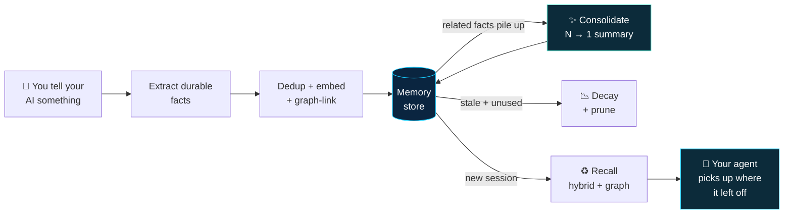
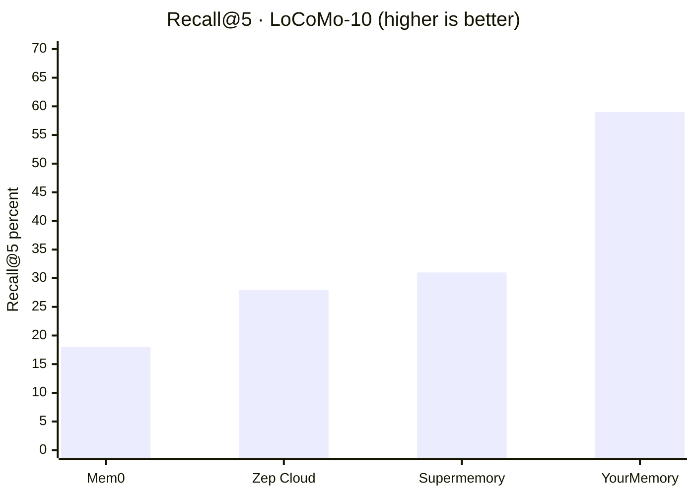
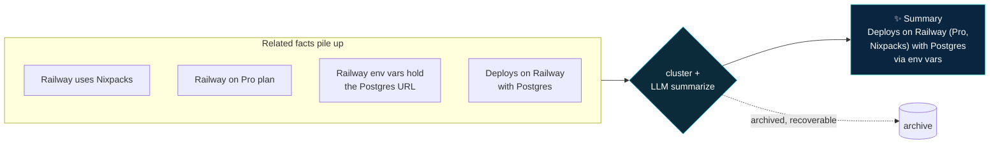
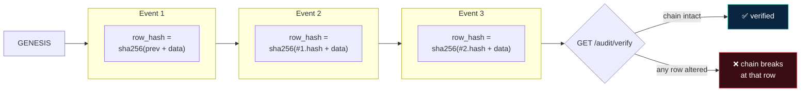
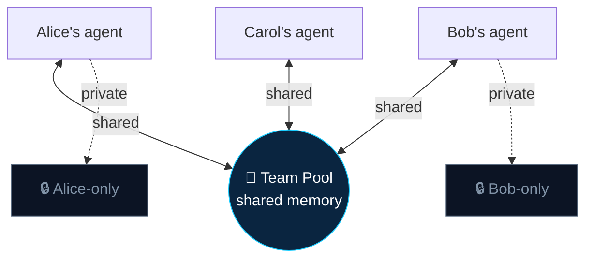
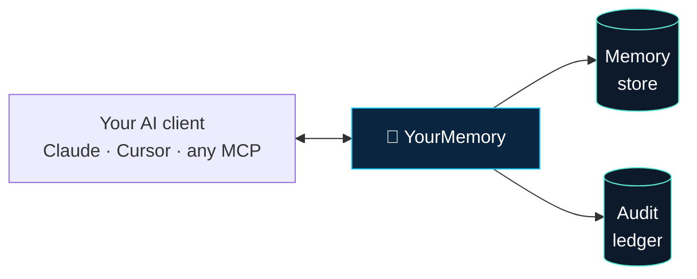

<!-- mcp-name: io.github.sachitrafa/yourmemory -->
<div align="center">
<br>
<h1>YourMemory</h1>

### Your AI has the memory of a goldfish. Not anymore.

**Persistent, self-improving memory for AI agents — built on the science of how humans remember.**

[](https://pypi.org/project/yourmemory/)
[](https://pypi.org/project/yourmemory/)
[](https://pypi.org/project/yourmemory/)
[](https://creativecommons.org/licenses/by-nc/4.0/)
[](https://github.com/sachitrafa/YourMemory)

[](BENCHMARKS.md)
[](BENCHMARKS.md)
[](BENCHMARKS.md)
[](https://modelcontextprotocol.io)

<br>

**[▶ Try the live interactive demo](https://sachitrafa.github.io/YourMemory/marketing/interactive.html)** · **[Website](https://yourmemoryai.xyz)** · **[Benchmarks](BENCHMARKS.md)**

</div>

---

## The problem

Every morning your AI agent treats you like a stranger. Same context re-explained. Same preferences forgotten. Every session starts from zero.

Most "memory" tools bolt a vector database onto an agent and call it done — but that's just **storage**. It hoards every near-duplicate until retrieval drowns in noise. A goldfish with a bigger bowl.

**YourMemory is different: memory that works like a brain, not a database.**



---

## ✨ What makes it different

| | Feature | What it does |
|---|---|---|
| 🧠 | **Consolidation** | When enough related facts accumulate, they're compressed into one clean summary and the originals are archived. Memory gets **sharper over time, not bloated**. |
| 📉 | **Biological decay** | Every memory ages on an **Ebbinghaus forgetting curve**. Stale, unused facts fade; important and frequently-recalled ones persist. |
| 🔗 | **Entity graph** | Memories link by shared people, places, and concepts — so recall surfaces what you *forgot to ask for*. |
| ♻️ | **Survives context resets** | When the context window compacts, YourMemory hands the working context back — no re-reading files to figure out where you were. |
| 🔒 | **Tamper-evident audit trail** | Every read / write / delete is logged in a **hash-chained** ledger. Alter one record and the chain breaks. |
| 👥 | **Team memory pools** | Role-based shared memory, so a whole team's agents draw on the same institutional knowledge — with private memories kept private. |
| 🛡️ | **Data rights built in** | One-command **export** (right to access) and **right-to-forget** (purge), plus SOC 2-aligned controls. |
| 🔌 | **MCP-native & local-first** | Works with Claude, Cursor, Cline, Windsurf, or any MCP client. Runs entirely on your machine — no API key, nothing leaves your system. |

> One command to install. DuckDB by default (zero setup), Postgres + pgvector for teams.

---

## Table of Contents

- [🏆 Benchmarks](#-benchmarks)
- [🚀 Quick Start](#-quick-start)
- [🧠 How Memory Works](#-how-memory-works)
  - [Consolidation](#consolidation--n--1)
  - [Decay](#decay--the-forgetting-curve)
  - [Hybrid Retrieval](#hybrid-retrieval--vector--bm25--graph)
- [🔒 Trust & Audit Trail](#-trust--audit-trail)
- [👥 Team Memory Pools](#-team-memory-pools)
- [🛡️ Data Rights & Compliance](#️-data-rights--compliance)
- [🎛️ Dashboards](#️-dashboards)
- [🔧 MCP Tools](#-mcp-tools)
- [⚡ Ask Without an LLM Call](#-ask-without-an-llm-call)
- [🔀 API Proxy — Guaranteed Memory](#-api-proxy--guaranteed-memory)
- [🏗️ Architecture & Stack](#️-architecture--stack)
- [🩺 Troubleshooting](#-troubleshooting)
- [🤝 Contributing](#-contributing)

---

## 🏆 Benchmarks

Three external datasets. Every number independently reproducible — [benchmark code lives in the repo](benchmarks/). Full methodology in [BENCHMARKS.md](BENCHMARKS.md).

### LoCoMo-10 — multi-session conversational memory



> **2× better recall than Zep Cloud** across all 10 samples. \*Supermemory and Mem0 exhausted free-tier quotas mid-benchmark; scores computed over the full 1,534 pairs.

### LongMemEval-S — 500 questions, ~53 distractor sessions each

The hardest standard benchmark for long-term memory. Each question is buried in ~53 sessions.

| Metric | Score |
|--------|:-----:|
| **Recall@5** (any gold session in top-5) | **89.4%** |
| Recall-all@5 (all gold sessions in top-5) | 84.8% |
| nDCG@5 (ranking quality) | 87.4% |

### HotpotQA — 200 multi-hop questions

| System | BOTH_FOUND@5 |
|--------|:------------:|
| **YourMemory** (vector + BM25 + entity graph) | **71.5%** |
| YourMemory (no entity edges) | 59.5% |

Entity graph edges add **+12 pp** — they traverse from Fact 1 to Fact 2 even when Fact 2 has low embedding similarity to the query.

*Writeup: [I built memory decay for AI agents using the Ebbinghaus forgetting curve](https://dev.to/sachit_mishra_686a94d1bb5/i-built-memory-decay-for-ai-agents-using-the-ebbinghaus-forgetting-curve-1b0e)*

---

## 🚀 Quick Start

**Python 3.11–3.14. No Docker, no database setup. All memory stored locally in `~/.yourmemory/`.**

```bash
pip install yourmemory
yourmemory-register <your-token>
yourmemory-setup
```

**Get your token:** visit **[yourmemoryai.xyz](https://yourmemoryai.xyz/)** → enter your email → verify with a 6-digit code → copy your token.

`yourmemory-setup` auto-detects and wires up **Claude Code, Claude Desktop, Cursor, Windsurf, and Cline**, then asks which backend to use:

- **DuckDB** — zero setup, single local file *(default)*
- **Postgres** — shared / production; you provide a `DATABASE_URL` (needs the pgvector extension)

> **Optional — smarter local extraction:** YourMemory works out of the box with built-in heuristics. For higher-quality, fully-local fact extraction, install [Ollama](https://ollama.com) and `yourmemory-setup` pulls the model (`qwen2.5:7b`, ~4.7 GB) automatically. Prefer the cloud? Set `YOURMEMORY_EXTRACT_BACKEND=anthropic`.

### Or install from a binary — no Python required

Prefer not to touch pip? Grab the standalone binary for your platform from the [latest release](https://github.com/sachitrafa/YourMemory/releases/latest):

| Platform | Asset |
|----------|-------|
| macOS (Apple Silicon) | `yourmemory-macos-arm64` |
| macOS (Intel) | `yourmemory-macos-x86_64` |
| Linux (x86-64) | `yourmemory-linux-x86_64` |
| Windows (x86-64) | `yourmemory-windows-x86_64.exe` |

```bash
# macOS / Linux
chmod +x yourmemory-macos-arm64
./yourmemory-macos-arm64 register <your-token>
./yourmemory-macos-arm64 setup
./yourmemory-macos-arm64            # start the server
```

One executable handles every command: `register`, `setup`, `ask "<question>"`, `path`, and (with no args) starts the server. Building your own binary is a single command — `./build-binary.sh` — and multi-platform release binaries are produced automatically by the [build workflow](.github/workflows/build-binary.yml).

---

## 🧠 How Memory Works

YourMemory treats memory as a living system — it **grows, consolidates, forgets, and connects**, the way a brain does.

### Consolidation — *N → 1*

Most memory tools just keep growing. YourMemory watches for clusters of related facts and, once enough accumulate, compresses them into a single clean summary — archiving the originals (never deleting, so nothing is lost).



> Real example from one production store: **444 memories → 16 summaries** — same knowledge, a fraction of the noise. Consolidation is **event-driven** (triggered when related memories pile up), not a blind nightly job.

### Decay — the forgetting curve

Memory strength decays exponentially. Importance and recall frequency slow that decay:

```
effective_λ  = base_λ × (1 − importance × 0.8)
strength     = clamp(importance × e^(−effective_λ × active_days) × (1 + recall_count × 0.2), 0, 1)
```

`active_days` counts only days you were active — vacations don't cause memory loss. Memories below strength `0.05` are pruned automatically. Each category ages at its own rate:

| Category | Half-life | Best for |
|----------|:---------:|----------|
| `strategy` | ~38 days | Patterns that worked, architectural decisions |
| `fact` | ~24 days | Preferences, identity, stable knowledge |
| `assumption` | ~19 days | Inferred context, uncertain beliefs |
| `failure` | ~11 days | Errors, wrong approaches, environment-specific issues |

**Chain-aware pruning:** a decayed memory is kept alive if any graph neighbour is still strong — load-bearing context survives even when rarely queried directly.

### Hybrid Retrieval — Vector + BM25 + Graph

Recall runs in two rounds so it surfaces both what you asked for *and* what you forgot to ask for:


**Subject-aware deduplication** runs before every store — it embeds the subject of each sentence so `"Sachit uses DuckDB"` and `"YourMemory uses DuckDB"` stay separate (different entities), while `"YourMemory uses DuckDB"` and `"YourMemory stores data in DuckDB"` merge (same entity). No hardcoded word lists; generalises to any language.

---

## 🔒 Trust & Audit Trail

Enterprises won't let an opaque black box store their data. So every operation — **read, write, update, delete, consolidation** — is appended to a **hash-chained, tamper-evident audit log**.



Each row records the timestamp, actor user + agent, action, operation, target memory, source (`http` vs `mcp`), and the previous row's hash. Change any historical record and `verify_chain()` pinpoints exactly where the chain broke.

```bash
GET  /audit            # browse the trail (filter by user / action / operation)
GET  /audit/verify     # cryptographically verify the chain is untampered
POST /audit/prune      # retention-based cleanup (90-day minimum, never lower)
```

> Audit logging is **fail-open** — it never blocks a memory operation — and read/list events from the dashboard's own render loop are excluded, so the trail stays signal, not noise.

---

## 👥 Team Memory Pools

Give a whole team's agents one shared brain — without leaking anyone's private context. Memories are either **shared** (visible to the pool) or **private** (visible only to their owner).



Role-based access is enforced per agent — what one engineer's agent learns, the whole team benefits from instantly; sensitive context stays scoped to its owner.

```bash
POST   /pools                          # create a pool
POST   /pools/{id}/members             # add a member (with role)
POST   /pools/{id}/memories            # contribute a shared memory
POST   /pools/{id}/retrieve            # recall across the pool
```

---

## 🛡️ Data Rights & Compliance

Because memory that stores real data needs the controls to be trusted with it:

| Right | Endpoint | What it does |
|-------|----------|--------------|
| **Access** (DSAR export) | `GET /users/{id}/export` | Full export of everything stored for a user |
| **Erasure** (right to forget) | `DELETE /users/{id}/memories` | One-command purge of a user's memories |
| **Portability** | `POST /users/{id}/import` | Re-import a previous export |
| **Recoverability** | `GET /users/{id}/archive` | Retrieve consolidated-away originals |

Combined with the hash-chained audit trail and 90-day retention floor, these map directly onto the controls documented in [SECURITY.md](SECURITY.md) (SOC 2-aligned).

---

## 🎛️ Dashboards

Two built-in browser UIs — no extra setup, they start automatically with the server.

### Memory Dashboard — `http://localhost:3033/ui`

A full read/write view with **Memories · Audit · Pools** tabs: stats bar (Strong / Fading / Near-prune), per-agent tabs, memory cards with live strength bars, category filters, the audit trail, and pool management.

### Graph Visualiser — `http://localhost:3033/graph`

An interactive force-directed map of how memories connect — root memory as a bright node, neighbours color-coded by category, edge thickness = connection strength. Drag, zoom, and click any node for full content.

```
http://localhost:3033/graph?memoryId=42&userId=alex&depth=2
```

---

## 🔧 MCP Tools

Three tools, called by your AI automatically.

| Tool | When your AI calls it | What it does |
|------|-----------------------|--------------|
| `recall_memory(query, current_path?)` | Start of every task | Surfaces memories ranked by similarity × decay strength; spatial boost for path-matched memories |
| `store_memory(content, importance, category?, context_paths?)` | After learning something new | Embeds, deduplicates, stores with decay; tags optional file/dir paths |
| `update_memory(id, new_content, importance)` | When a stored fact is outdated | Re-embeds and replaces; logs the change to the audit trail |

```python
# Store with spatial context
store_memory(
    "Alex prefers tabs over spaces in Python",
    importance=0.9, category="fact",
    context_paths=["/projects/backend"],
)

# Next session — spatial boost fires when working in that directory
recall_memory("Python formatting", current_path="/projects/backend")
# → {"content": "Alex prefers tabs over spaces in Python", "strength": 0.87}
```

---

## ⚡ Ask Without an LLM Call

The only memory system that can answer questions **without making any LLM API call**:

```bash
yourmemory ask "what database does this project use"
# → YourMemory uses DuckDB locally and Postgres in production.

yourmemory ask "how do I fix a kubernetes deployment"
# → Not enough memory context to answer without an LLM.
```

When memory is strong enough it answers instantly — zero tokens, zero cloud cost, zero latency. When it isn't, it declines cleanly rather than hallucinating. Your query never leaves your machine.

---

## 🔀 API Proxy — Guaranteed Memory

MCP tools are called at the AI's discretion. The API proxy removes that uncertainty — it intercepts every LLM call, injects relevant memories automatically, and handles `store_memory` / `update_memory` with no model configuration.

Start the server (`yourmemory`), then point your client at `localhost:3033`:

```python
from anthropic import Anthropic

client = Anthropic(
    api_key="sk-ant-...",
    base_url="http://localhost:3033/proxy/anthropic",
    default_headers={"X-YourMemory-User": "alex"},  # per-user memory
)

# Memory is injected automatically — no other changes needed
response = client.messages.create(
    model="claude-opus-4-8",
    max_tokens=1024,
    messages=[{"role": "user", "content": "What database do I use?"}],
)
```

OpenAI works identically via `base_url="http://localhost:3033/proxy/openai"`.

---

## 🏗️ Architecture & Stack



| Component | Role |
|-----------|------|
| **DuckDB** | Default vector store — zero setup, native cosine similarity |
| **PostgreSQL + pgvector** | Optional — for teams or large datasets |
| **NetworkX** | Default graph backend (`~/.yourmemory/graph.pkl`) |
| **Neo4j** | Optional graph backend |
| **sentence-transformers** | Local embeddings (`multi-qa-mpnet-base-dot-v1`, 768 dims) |
| **spaCy** | Local NLP for deduplication and entity extraction |
| **APScheduler** | Automatic decay + pruning |

---

## 🩺 Troubleshooting

**Writes hang / time out (DuckDB single-writer lock).** If both the MCP server and the HTTP server run at once, they compete for the DuckDB write lock. Fix:

```bash
pkill -f yourmemory 2>/dev/null || true
rm -f ~/.yourmemory/memories.duckdb.wal ~/.yourmemory/memories.duckdb.lock 2>/dev/null || true
# restart your client
```

Running Claude Desktop (MCP) and Claude Code (hooks) simultaneously? Use SQLite instead — it handles concurrent readers/writers cleanly:
`DATABASE_URL=sqlite:///~/.yourmemory/memories.db`

---

## 🤝 Contributing

PRs welcome — see [CONTRIBUTORS.md](CONTRIBUTORS.md).

## 📚 Dataset References

- [LoCoMo](https://github.com/snap-research/locomo) — Maharana et al. (2024)
- [LongMemEval](https://github.com/xiaowu0162/LongMemEval) — Wu et al. (2024)
- [HotpotQA](https://hotpotqa.github.io/) — Yang et al. (2018)

## 📄 License

Copyright 2026 **Sachit Misra** — Licensed under [CC-BY-NC-4.0](LICENSE).

**Free for** personal use, education, academic research, and open-source projects.
**Commercial use** requires a separate written agreement → mishrasachit1@gmail.com

<div align="center"><br><b>Give your AI a memory worth keeping.</b><br><code>pip install yourmemory</code></div>
